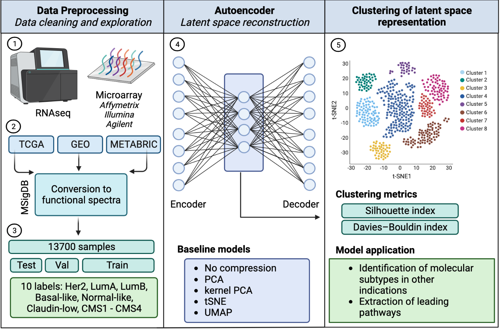

# The Application of Deep Learning for Cancer Subtype Identification (UCT Prague)

## **Abstract:**

Human cancer is a heterogeneous disease initiated by random somatic mutations and driven by multiple genomic alterations. Cancer subtype classification has the potential to significantly improve disease prognosis and move closer toward personalized cancer
treatment and prevention. The assumption behind molecular subtyping is that patients of similar gene expression patterns are likely to have similar responses to therapies and clinical outcomes due to the tumor microenvironment. Thus, molecular subtyping can reveal information valuable for a range of cancer studies from cancer initiation and tumor biology to prognosis and personalized medicine. Molecular subtyping was widely described in breast and colorectal cancer, however, it was not broadly explored in other indications. In this work, molecular subtypes are explored via deep learning models, specifically the standard and variational autoencoder latent space. The analysis is performed on a range of publicly available datasets such as Gene Expression Omnibus (GEO), The Cancer Genome Atlas (TCGA) and the Molecular Taxonomy of Breast Cancer International Consortium (METABRIC).

## **Goals:**

* Prepare the data for modeling
* Quality control of the data with classification framework DeepCC
* Implementation of the standard and variational autoencoder and baseline models
* Comparision of models

## **Data analysis overview:**

* **Data preparation steps:**
   * To unify gene names and gene IDs, Affymetrix / Illumina / Agilent probeset IDs were converted to Entrez ID
   * Removal of unlabelled samples and unification of subtype in case of breast and colorectal cancer datasets 
   * Removal of non-tumor tissue samples
   * Replacing missing expression values with zero constant
   * Removal of technical variation with conversion of genes to functional spectra
   * Principal component analysis (PCA) to reduce the dimensionality of the data
   * Oversampling of data with adaptive synthetic sampling approach (ADASYN) to solve imbalancing problem
* **Used models:**
    * Standard Autoencoder
    * Variational Autoencoder
    * kernel PCA with poly and sigmoid kernels
    * PCA 
    * Data without compression

## **Data:**

* Input data is represented by a matrix, where columns are sample names and rows are ENTREZ ID; in some cases the data were directly downloaded from GEO database with GEOparse package, otherwise data were loaded from [cBioPortals](https://www.cbioportal.org/) or Bioconductor packages ([breastCancerNKI](https://bioconductor.org/packages/release/data/experiment/html/breastCancerNKI.html), [breastCancerUNT](http://bioconductor.org/packages/release/data/experiment/html/breastCancerUNT.html), [breastCancerTRANSBIG](https://bioconductor.org/packages/release/data/experiment/html/breastCancerTRANSBIG.html), and [breastCancerUPP](https://bioconductor.org/packages/release/data/experiment/html/breastCancerUPP.html)); colorectal cancer datasets were loaded from [Synapse](https://synapse.org)
* Data collection was the most time consuming step as majority of GEO gene expression datasets have around 100 samples
* A list of datasets used for the project is shown below

| Cancer |     ID    |         Technology        |  Tissue type  |                        Normalization                       | Number of samples |    Source    |
|--------|:---------:|:-------------------------:|:-------------:|:----------------------------------------------------------:|:-----------------:|:------------:|
| CRC    |  GSE33113 |   Affymetrix HG133plus2   |  Fresh frozen |                            fRMA                            |         80        |    Synapse   |
| CRC    |  GSE39582 |   Affymetrix HG133plus2   |  Fresh frozen |                            fRMA                            |        466        |    Synapse   |
| CRC    |  KFSYSCC  |   Affymetrix HG133plus2   |  Fresh frozen |                            fRMA                            |        229        |    Synapse   |
| CRC    |  GSE35896 |   Affymetrix HG133plus2   |  Fresh frozen |                            fRMA                            |         51        |    Synapse   |
| CRC    |  PETACC3  |  Almac's Affymetrix Array |      FFPE     |                            fRMA                            |        526        |    Synapse   |
| CRC    |  GSE13067 |   Affymetrix HG133plus2   |  Fresh frozen |                            fRMA                            |         56        |    Synapse   |
| CRC    |  GSE20916 |   Affymetrix HG133plus2   |  Fresh frozen |                            fRMA                            |         45        |    Synapse   |
| CRC    |  GSE23878 |   Affymetrix HG133plus2   |  Fresh frozen |                            fRMA                            |         24        |    Synapse   |
| CRC    |  GSE14333 |   Affymetrix HG133plus2   |  Fresh frozen |                            fRMA                            |        129        |    Synapse   |
| CRC    |  GSE2109  |   Affymetrix HG133plus2   |  Fresh frozen |                             RMA                            |        244        |    Synapse   |
| CRC    |  GSE17536 |   Affymetrix HG133plus2   |  Fresh frozen |                            fRMA                            |        147        |    Synapse   |
| CRC    |  GSE13294 |   Affymetrix HG133plus2   |  Fresh frozen |                            fRMA                            |        124        |    Synapse   |
| CRC    |  GSE37892 |   Affymetrix HG133plus2   |  Fresh frozen |                            fRMA                            |        107        |    Synapse   |
| CRC    |    TCGA   |       RNA sequencing      | Primary Tumor |                            RSEM                            |        207        |    Synapse   |
| BRCA   |  GSE96058 |       RNA sequencing      | Primary Tumor |                            FPKM                            |        3273       |      GEO     |
| BRCA   |  GSE65194 |   Affymetrix HG133plus2   | Primary Tumor | GC-RMA log2                                                |         98        |      GEO     |
| BRCA   |  GSE81538 |       RNA sequencing      | Primary Tumor |                            FPKM                            |        405        |      GEO     |
| BRCA   |    ROCK   |   Affymetrix HG133plus2   | Primary Tumor |                         log2 andRMA                        |        1468       |      GEO     |
| BRCA   |  METABRIC |       Illumina Array      | Primary Tumor |                   quantile normalization                   |        1898       |  cBioPortal  |
| BRCA   |    TCGA   |       RNA sequencing      | Primary Tumor |                            RSEM                            |        981        |  cBioPortal  |
| BRCA   |   CPTAC   |       RNA sequencing      | Primary Tumor |                             TPM                            |        122        |  cBioPortal  |
| BRCA   |    SMC    |       RNA sequencing      | Primary Tumor |                             TPM                            |        168        |  cBioPortal  |
| BRCA   |    NKI    |   Agilent Rosetta Array   | Primary Tumor |                             N/A                            |        337        | Bioconductor |
| BRCA   |  TRANSBIG | Affymetrix HG U133A Array | Primary Tumor |                       MAS5 normalized                      |        198        | Bioconductor |
| BRCA   |    UPP    | Affymetrix HG U133A Array | Primary Tumor | log transformed and scaled by adjusting the mean intensity |        190        | Bioconductor |
| BRCA   |    UNT    | Affymetrix HG U133A Array | Primary Tumor |                             RMA                            |         92        | Bioconductor |
| BRCA   |  GSE60789 |       Illumina Array      | Primary Tumor |                Illumina BeadStudio software                |         55        |      GEO     |
| BRCA   |  GSE59595 |       Illumina Array      | Primary Tumor |                             RSN                            |        133        |      GEO     |
| BRCA   |  GSE53031 |  Affymetrix HG 219 Array  | Primary Tumor |                             RMA                            |        167        |      GEO     |
| BRCA   |  GSE56493 |   Rosetta/Merck HG2plus2  |      FNA      |                             RMA                            |        120        |      GEO     |
| BRCA   |  GSE78958 |   Affymetrix HG133plus2   | Primary Tumor |               Partek Genomics Suite software               |        424        |      GEO     |
| BRCA   |  GSE20711 |   Affymetrix HG133plus2   | Primary Tumor |                             RMA                            |         88        |      GEO     |
| BRCA   |  GSE45827 |   Affymetrix HG133plus2   | Primary Tumor |                            REML                            |        130        |      GEO     |
| BRCA   |  GSE21653 |   Affymetrix HG133plus2   | Primary Tumor |                             RMA                            |        242        |      GEO     |
| BRCA   |  GSE25066 | Affymetrix HG U133A Array | Primary Tumor |                       MAS5 normalized                      |        508        |      GEO     |
| BRCA   |  GSE48390 |   Affymetrix HG133plus2   | Primary Tumor |                             RMA                            |         74        |      GEO     |
| BRCA   | GSE135298 |       RNA sequencing      | Primary Tumor |                            FPKM                            |         93        |      GEO     |
| Total  |     -     |             -             |       -       |                              -                             |       13700       |       -      |

**Tissue types:** 

* FFPE - a formalin-fixed paraffin-embedded tissue
* FNA - a fine needle aspiration biopsy.

**Normalization:**

* FPKM - Fragments Per Kilobase per Million mapped fragments
* REML - Restricted Maximum Likelihood
* (f)RMA - (frozen) Robust Multi-array Average
* RSEM - RNA-Seq by Expectation-Maximization
* RSN - Robust Spline Normalization

## Environment

Data processing, modeling and evaluation were implemented using Python 3.8.10 and Google Colab 0.0.1a2. The following data science and machine learning packages were used: imbalanced-learn 0.8.1, biomart 0.9.2, keras 2.6.0, numpy 1.22.4, pandas 1.3.5, scikit-learn 1.2.1, scipy 1.10.1, keras 2.11.0, rpy2 3.5.5, umap 0.5.3, and seaborn 0.11.2, matplotlib 3.5.1 and plotly 5.5.0 were used for plotting. 

* Preprocessing of the data were conducted on the “KOIOS” high performance computing (HPC) system
   * OS: Gentoo 2.9
   * Kernel: x86_64 Linux 5.15.26-gentoo-x86_64
   * Shell: bash 5.1.16
   * CPU: Intel Xeon Gold 6238 @ 88x 3.7GHz 
   * GPU: ASPEED Technology, Inc. ASPEED Graphics Family (rev 41)
   * RAM: 1081 GB
* Modeling was performed on Google Colab machine:   
   * GPU: NVIDIA A100-SXM4-40GB
   * RAM: 25.5 GB
   * CPU: Intel(R) Xeon(R) CPU @ 4x, 2.00GHz
